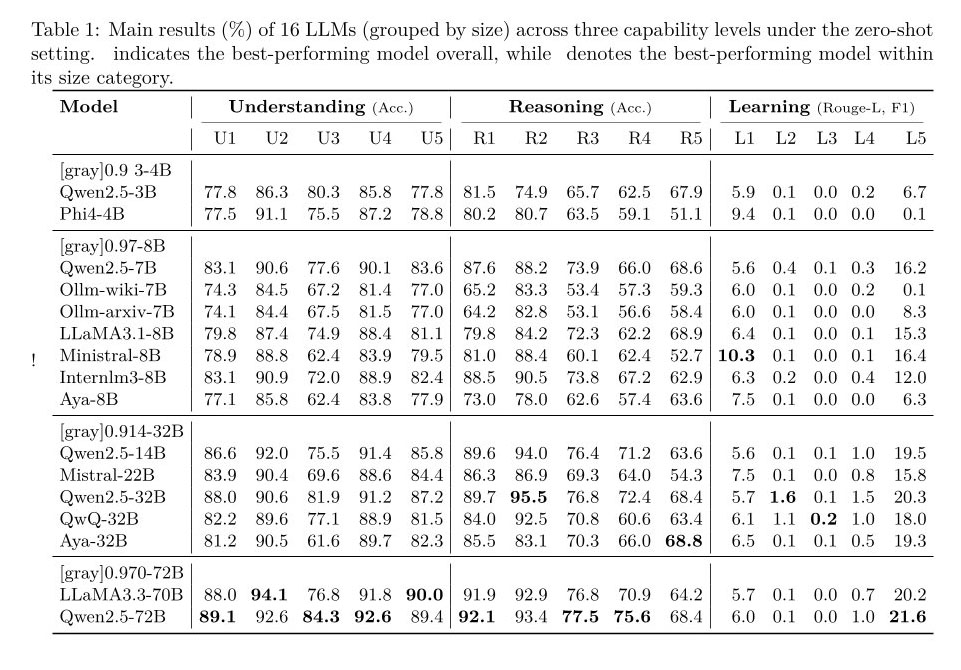

  

  <a href="https://arxiv.org/abs/xxxx.xxxxx">📄 Paper</a> •
  <a href="https://huggingface.co/datasets/XiaoZhang98/OntoURL">🤗 Dataset</a> •
  <a href="#task-categories">🧠 Tasks</a> •
  <a href="#baseline-results-sample">📊 Results</a> •
  <a href="#citation">✍ Citation</a>

---

<h2 id="updates">🆕 Updates</h2>

May   15, 2025 ----- The paper OntoURL is submitted to NeruoIPS 2025.

April 30, 2025 ----- OntoURL 1.0 is available!

<h2 id="motivation">🧠 Motivation</h2>

**OntoURL** explores three fundamental dimensions:

1. **Understanding**: The ability of LLM to memorize fine-grained ontological details, including classes, properties, instances and relationships...
2. **Reasoning**: The ability of LLM to perform reasoning, such as transitive inference, SWRL reasoning, complex logic reasoning...
3. **Learning**: The ability of LLM to autonomously construct and refine ontologies, such as class definition generation, hierarchy construction...

---

<h2 id="dataset">📦 Dataset Overview</h2>

<pre><code>
from datasets import load_dataset

# Login using e.g. `huggingface-cli login` to access this dataset
ds = load_dataset("XiaoZhang98/OntoURL")

</code></pre>

---
<h2 id="task-categories">🧠 Tasks</h2>

Overview of 15 Tasks for Evaluating Ontological Capabilities

| Capability | ID | Task Description | Question Type | Metric | Sample Size |
| --- | --- | --- | --- | --- | --- |
| **Understanding** | U1 | Class definition understanding | MCQ | Accuracy | 9,151 |
|  | U2 | Class relation understanding | MCQ | Accuracy | 9,201 |
|  | U3 | Property domain understanding | MCQ | Accuracy | 375 |
|  | U4 | Instance class understanding | MCQ | Accuracy | 2,475 |
|  | U5 | Instance definition understanding | MCQ | Accuracy | 3,814 |
| **Reasoning**  | R1 | Inferred relation reasoning | MCQ | Accuracy | 8,208 |
|  | R2 | Constraint reasoning | MCQ | Accuracy | 6,956 |
|  | R3 | Instance class reasoning | MCQ | Accuracy | 3,793 |
|  | R4 | SWRL-based logic reasoning | MCQ | Accuracy | 6,517 |
|  | R5 | Description logic reasoning | T/FQ | Accuracy | 2,560 |
| **Learning** | L1 | Class definition generation | Generation | ROUGE-L | 2,936 |
|  | L2 | Class hierarchy construction | Generation | Triple-F1 | 952 |
|  | L3 | Property relation construction | Generation | Triple-F1 | 256 |
|  | L4 | Constraint construction | Generation | Triple-F1 | 643 |
|  | L5 | Ontology alignment | Generation | Tuple-F1 | 1,149 |

*Table 1: Overview of 15 tasks for evaluating ontological understanding, reasoning, and learning capabilities. Note: MCQ = Multiple-Choice Question; T/FQ = True/False Question.*

---
<h2 id="code"> 💻 Code Hierarchy and Usage</h2>

- The benchmark construction from scratch code is available at https://github.com/LastDance500/Bench_Construct
- In this repo, you can
  - download the .csv file in ./benchmark
  - run LLM inference in ./inference
  - evaluate the results in ./inference
  - follow the following instructions to know how to run the inference
---

<h2 id="get-started">🚀 Getting Started</h2>

1. Requirements

<pre><code>
pip install -r requirements.txt
</code></pre>

2. Run Baseline Models

<pre><code>
cd inference
sbatch run_qwen2.5_7b.sh

#!!!! if you don't use sbatch, use the following command instead

# Task 1 and 2
splits=(1_1 1_2 1_3 1_4 1_5 2_1 2_2 2_3 2_4 2_5)
shots=(zero_shot two_shot four_shot)

for split in "${splits[@]}"; do
    for shot in "${shots[@]}"; do
        echo "▶ Running split=$split, prompt=$shot"
        prompt_path="./prompt/bench_${split}/${shot}.txt"
        CUDA_VISIBLE_DEVICES=0,1,2,3 python infer_script.py \
              --dataset XiaoZhang98/OntoBench \
              --split_index "$split" \
              --model Qwen/Qwen2.5-7B-Instruct \
              --prompt_path "$prompt_path" \
              --output_dir ./output \
              --max_batched_tokens 8192 \
              --max_tokens 128 \
              --temperature 0.0 \
              --top_p 1.0
    done
done

# Task 3
splits=(3_1 3_2 3_3 3_4 3_5)
shots=(zero_shot two_shot four_shot)

for split in "${splits[@]}"; do
    for shot in "${shots[@]}"; do
        echo "▶ Running split=$split, prompt=$shot"
        prompt_path="./prompt/bench_${split}/${shot}.txt"
        CUDA_VISIBLE_DEVICES=0,1,2,3 python infer_script.py \
              --dataset XiaoZhang98/OntoBench \
              --split_index "$split" \
              --model Qwen/Qwen2.5-7B-Instruct \
              --prompt_path "$prompt_path" \
              --output_dir ./output \
              --max_batched_tokens 8192 \
              --max_tokens 512 \
              --temperature 0.0 \
              --top_p 1.0
    done
done

</code></pre>

3. output
  - the script will automatically generate a csv file,
  containing all the scores and information, in the folder ./inference/output
  - the sample-wise output of the model are also automatically generated in the folder ./inference/output

<h2 id="baseline-results-sample">📊 Results</h2>

  

---

<h2 id="citation">✍ Citation</h2>

If you use OntoURL in your research, please cite:

<h2 id="license">⚖️ License</h2>

Because OntoURL uses open source data, its license is Creative Commons Attribution 4.0 International (CC BY 4.0)—you’re free to share and adapt the dataset provided that you give appropriate credit to the original source.

<h2 id="acknowledgement">🙌 Acknowledgements</h2>

Thanks all contributors. 
Any valuable suggestions and comments are welcomed and acknowledged. 

<h2 id="contact">📬 Contact</h2>
For questions, feedback, or collaborations, please contact: xiao.zhang@rug.nl

