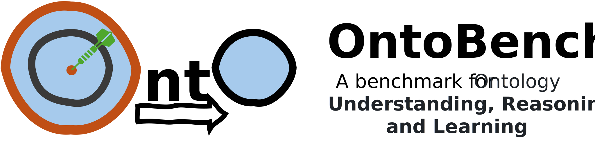

  

  <a href="https://arxiv.org/abs/xxxx.xxxxx">📄 Paper</a> •
  <a href="https://huggingface.co/datasets/XiaoZhang98/OntoBench">🤗 Dataset</a> •
  <a href="#task-categories">🧠 Tasks</a> •
  <a href="#baseline-results-sample">📊 Results</a> •
  <a href="#citation">✍ Citation</a>

---

<h2 id="updates">🆕 Updates</h2>

April 30, 2025 ----- OntoBench 1.0 is available!

<h2 id="motivation">🧠 Motivation</h2>

**OntoBench** explores three fundamental dimensions:

1. **Understanding**: The ability of LLM to memorize fine-grained ontological details, including classes, properties, instances and relationships...
2. **Reasoning**: The ability of LLM to perform reasoning, such as transitive inference, SWRL reasoning, complex logic reasoning...
3. **Learning**: The ability of LLM to autonomously construct and refine ontologies, such as class definition generation, hierarchy construction...

---

<h2 id="dataset">📦 Dataset Overview</h2>

---
<h2 id="task-categories">🧠 Tasks</h2>
## 📑 Task Overview:

### 1 Understanding
#### 1_1
#### 1_2
#### ...

### 2 Reasoning
#### 2_1
#### 2_2
#### ...

### 3 Reasoning
#### 3_1
#### 3_2
#### ...

---
<h2 id="code"> 💻 Code Hierarchy and Usage</h2>

- **Structure**:

- **Bench Construction and Reproduction**

---

<h2 id="get-started">🚀 Getting Started</h2>

1. Requirements

2. Load OntoBench via HuggingFace datasets

3. Run Baseline Models

<h2 id="baseline-results-sample">📊 Results</h2>

---

<h2 id="citation">✍ Citation</h2>

If you use OntoBench in your research, please cite:

<h2 id="license">⚖️ License</h2>

This project is licensed under the MIT License.

<h2 id="acknowledgement">🙌 Acknowledgements</h2>

We thank 

<h2 id="contact">📬 Contact</h2>
For questions, feedback, or collaborations, please contact: xiao.zhang@rug.nl

