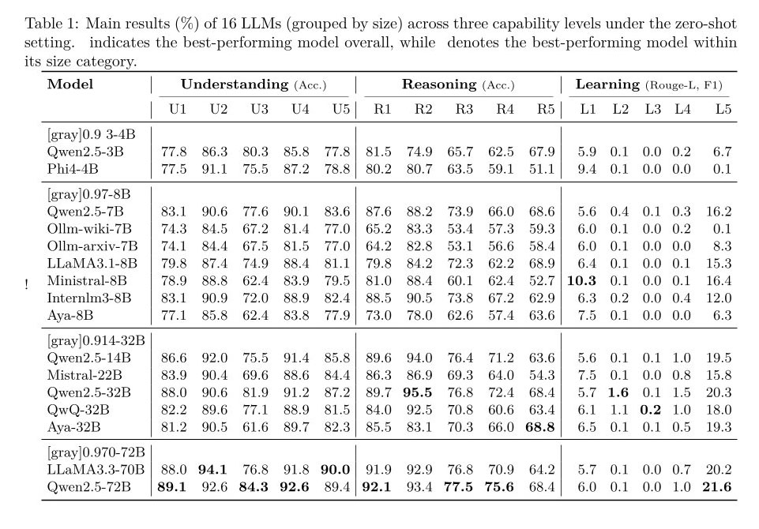

<p align="center">
  
</p>

<p align="center">
  <a href="https://arxiv.org/abs/2505.11031">📄 Paper</a> •
  <a href="https://huggingface.co/datasets/XiaoZhang98/OntoURL">🤗 Dataset</a> •
  <a href="#task-categories">🧠 Tasks</a> •
  <a href="#baseline-results-sample">📊 Results</a> •
  <a href="#citation">✍ Citation</a>
</p>

---

## 🔍 Overview

**OntoURL** is a benchmark for evaluating the ontological capabilities of Large Language Models (LLMs), spanning three critical dimensions:

- **Understanding**: Grasping fine-grained ontology content such as class definitions, relations, properties, and instances.
- **Reasoning**: Performing symbolic inference including description logic, SWRL-based reasoning, and constraint propagation.
- **Learning**: Generating and refining ontology structures, definitions, and alignments.

---

<h2 id="updates">🆕 Updates</h2>

- **May 15, 2025** — Paper submitted to *NeurIPS 2025*
- **April 30, 2025** — OntoURL v1.0 released on Hugging Face


<h2 id="todo">📝 To Do</h2>

- The **website and leader board** of OntoURL under construction.
- **Multi-lingual OntoURL**: We plan to include EN, DE, IT, ZH, JA, and more languages.
- **Multi-model OntoURL**: We plan to include more modalities. 

---

<h2 id="dataset">📦 Dataset Assess</h2>

You can load OntoURL via the 🤗 Datasets library:

```python
from datasets import load_dataset

# Authenticate with `huggingface-cli login` if needed
ds = load_dataset("XiaoZhang98/OntoURL")
```

---

<h2 id="task-categories">🧠 Tasks</h2>

OntoURL defines **15 tasks** covering understanding, reasoning, and learning:

| Category        | ID  | Task Description                 | Format     | Metric     | Size   |
|----------------|-----|----------------------------------|------------|------------|--------|
| **Understanding** | U1  | Class definition understanding     | MCQ        | Accuracy   | 9,151  |
|                 | U2  | Class relation understanding       | MCQ        | Accuracy   | 9,201  |
|                 | U3  | Property domain understanding      | MCQ        | Accuracy   | 375    |
|                 | U4  | Instance class understanding       | MCQ        | Accuracy   | 2,475  |
|                 | U5  | Instance definition understanding  | MCQ        | Accuracy   | 3,814  |
| **Reasoning**     | R1  | Inferred relation reasoning        | MCQ        | Accuracy   | 8,208  |
|                 | R2  | Constraint reasoning               | MCQ        | Accuracy   | 6,956  |
|                 | R3  | Instance class reasoning           | MCQ        | Accuracy   | 3,793  |
|                 | R4  | SWRL-based logic reasoning         | MCQ        | Accuracy   | 6,517  |
|                 | R5  | Description logic reasoning        | T/F        | Accuracy   | 2,560  |
| **Learning**       | L1  | Class definition generation        | Generation | ROUGE-L    | 2,936  |
|                 | L2  | Class hierarchy construction       | Generation | Triple-F1  | 952    |
|                 | L3  | Property relation construction     | Generation | Triple-F1  | 256    |
|                 | L4  | Constraint construction            | Generation | Triple-F1  | 643    |
|                 | L5  | Ontology alignment                 | Generation | Tuple-F1   | 1,149  |

> *MCQ = Multiple-Choice Question, T/F = True/False Question*

---

## 💻 Repository Structure

The full benchmark code is available here:  
🔗 https://github.com/LastDance500/Bench_Construct

Contents:
- `./benchmark/` — CSV files for all task splits
- `./inference/` — Scripts for LLM inference and evaluation
- `./prompt/` — Prompt templates for each task and setting

---

## 🚀 Quick Start

### 1. Install Requirements

```bash
pip install -r requirements.txt
```

### 2. Run Baseline Inference

```bash
cd inference
sbatch run_qwen2.5_7b.sh  # If using SLURM

# OR run manually:
splits=(1_1 1_2 1_3 1_4 1_5 2_1 2_2 2_3 2_4 2_5)
shots=(zero_shot two_shot four_shot)

for split in "${splits[@]}"; do
  for shot in "${shots[@]}"; do
    echo "▶ Running split=$split, prompt=$shot"
    prompt_path="./prompt/bench_${split}/${shot}.txt"
    CUDA_VISIBLE_DEVICES=0,1,2,3 python infer_script.py \
        --dataset XiaoZhang98/OntoURL \
        --split_index "$split" \
        --model Qwen/Qwen2.5-7B-Instruct \
        --prompt_path "$prompt_path" \
        --output_dir ./output \
        --max_batched_tokens 8192 \
        --max_tokens 128 \
        --temperature 0.0 \
        --top_p 1.0
  done
done
```

For **Task 3** (longer generation):

```bash
splits=(3_1 3_2 3_3 3_4 3_5)

for split in "${splits[@]}"; do
  for shot in "${shots[@]}"; do
    prompt_path="./prompt/bench_${split}/${shot}.txt"
    CUDA_VISIBLE_DEVICES=0,1,2,3 python infer_script.py \
        --dataset XiaoZhang98/OntoURL \
        --split_index "$split" \
        --model Qwen/Qwen2.5-7B-Instruct \
        --prompt_path "$prompt_path" \
        --output_dir ./output \
        --max_batched_tokens 8192 \
        --max_tokens 512 \
        --temperature 0.0 \
        --top_p 1.0
  done
done
```

### 3. Output

- All inference results and logs are saved in `./inference/output/`:
  - Summary CSV with task-level scores
  - Sample-wise predictions

---

<h2 id="baseline-results-sample">📊 Results</h2>

<p align="center">
  
</p>

---

<h2 id="citation">✍ Citation</h2>

If you use OntoURL in your research, please cite:

```bibtex
@article{zhang2025ontourl,
  title={OntoURL: A Benchmark for Evaluating Large Language Models on Symbolic Ontological Understanding, Reasoning and Learning},
  author={Zhang, Xiao and Lai, Huiyuan and Meng, Qianru and Bos, Johan},
  journal={arXiv preprint arXiv:2505.11031},
  year={2025}
}
```

---

<h2 id="license">⚖️ License</h2>

OntoURL is released under the **Creative Commons Attribution 4.0 International (CC BY 4.0)** license. You are free to share and adapt the dataset with proper attribution.

---

<h2 id="acknowledgement">🙌 Acknowledgements</h2>

We thank all contributors to this project. Feedback and suggestions are warmly welcomed.

---

<h2 id="contact">📬 Contact</h2>

For questions, feedback, or collaborations, please contact:  
📧 xiao.zhang@rug.nl
