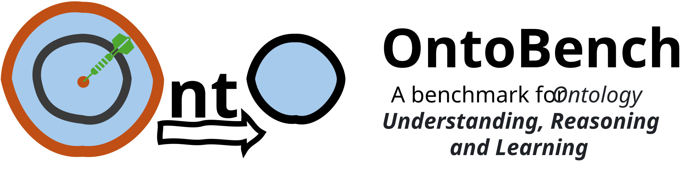

<p align="center">
  
</p>

<p align="center">
  <a href="https://arxiv.org/abs/2505.11031">📄 Paper</a> •
  <a href="https://huggingface.co/datasets/XiaoZhang98/OntoURL">🤗 Dataset</a> •
  <a href="#task-categories">🧠 Tasks</a> •
  <a href="#baseline-results-sample">📊 Results</a> •
  <a href="#citation">✍ Citation</a>
</p>

---

## 🔍 Overview

**OntoURL** is a benchmark for evaluating the ontological capabilities of Large Language Models (LLMs), spanning three critical dimensions:

- **Understanding**: Grasping fine-grained ontology content such as class definitions, relations, properties, and instances.
- **Reasoning**: Performing symbolic inference including description logic, SWRL-based reasoning, and constraint propagation.
- **Learning**: Generating and refining ontology structures, definitions, and alignments.

---

<h2 id="updates">🆕 Updates</h2>

- **May 15, 2025** — Paper submitted to *NeurIPS 2025*
- **April 30, 2025** — OntoURL v1.0 released on Hugging Face


<h2 id="todo">📝 To Do</h2>

- The **website and leader board** of OntoURL under construction.
- **Multi-lingual OntoURL**: We plan to include EN, DE, IT, ZH, JA, and more languages.
- **Multi-model OntoURL**: We plan to include more modalities. 

---

<h2 id="dataset">📦 Dataset Assess</h2>

You can load OntoURL via the 🤗 Datasets library:

```python
from datasets import load_dataset

# Authenticate with `huggingface-cli login` if needed
ds = load_dataset("XiaoZhang98/OntoURL")
```

---

<h2 id="task-categories">🧠 Tasks</h2>

OntoURL defines **15 tasks** covering understanding, reasoning, and learning:

| Category        | ID  | Task Description                 | Format     | Metric     | Size   |
|----------------|-----|----------------------------------|------------|------------|--------|
| **Understanding** | U1  | Class definition understanding     | MCQ        | Accuracy   | 9,151  |
|                 | U2  | Class relation understanding       | MCQ        | Accuracy   | 9,201  |
|                 | U3  | Property domain understanding      | MCQ        | Accuracy   | 375    |
|                 | U4  | Instance class understanding       | MCQ        | Accuracy   | 2,475  |
|                 | U5  | Instance definition understanding  | MCQ        | Accuracy   | 3,814  |
| **Reasoning**     | R1  | Inferred relation reasoning        | MCQ        | Accuracy   | 8,208  |
|                 | R2  | Constraint reasoning               | MCQ        | Accuracy   | 6,956  |
|                 | R3  | Instance class reasoning           | MCQ        | Accuracy   | 3,793  |
|                 | R4  | SWRL-based logic reasoning         | MCQ        | Accuracy   | 6,517  |
|                 | R5  | Description logic reasoning        | T/F        | Accuracy   | 2,560  |
| **Learning**       | L1  | Class definition generation        | Generation | ROUGE-L    | 2,936  |
|                 | L2  | Class hierarchy construction       | Generation | Triple-F1  | 952    |
|                 | L3  | Property relation construction     | Generation | Triple-F1  | 256    |
|                 | L4  | Constraint construction            | Generation | Triple-F1  | 643    |
|                 | L5  | Ontology alignment                 | Generation | Tuple-F1   | 1,149  |

> *MCQ = Multiple-Choice Question, T/F = True/False Question*

---

## 💻 Repository Structure

The code for construction of OntoURL is available here:  
🔗 https://github.com/LastDance500/Bench_Construct

Contents:
- `./benchmark/` — CSV files for all task splits
- `./inference/` — Scripts for LLM inference and evaluation
- `./inference/prompt/` — Prompt templates for each task and setting

---

## 🚀 Quick Start

### 1. Install Requirements

```bash
pip install -r requirements.txt
```

### 2. Run Baseline Inference

```bash
cd inference
sbatch run_qwen2.5_7b.sh  # If using SLURM

# OR run manually:
splits=(1_1 1_2 1_3 1_4 1_5 2_1 2_2 2_3 2_4 2_5)
shots=(zero_shot two_shot four_shot)

for split in "${splits[@]}"; do
  for shot in "${shots[@]}"; do
    echo "▶ Running split=$split, prompt=$shot"
    prompt_path="./prompt/bench_${split}/${shot}.txt"
    CUDA_VISIBLE_DEVICES=0,1,2,3 python infer_script.py \
        --dataset XiaoZhang98/OntoURL \
        --split_index "$split" \
        --model Qwen/Qwen2.5-7B-Instruct \
        --prompt_path "$prompt_path" \
        --output_dir ./output \
        --max_batched_tokens 8192 \
        --max_tokens 128 \
        --temperature 0.0 \
        --top_p 1.0
  done
done
```

For **Task 3** (longer generation):

```bash
splits=(3_1 3_2 3_3 3_4 3_5)

for split in "${splits[@]}"; do
  for shot in "${shots[@]}"; do
    prompt_path="./prompt/bench_${split}/${shot}.txt"
    CUDA_VISIBLE_DEVICES=0,1,2,3 python infer_script.py \
        --dataset XiaoZhang98/OntoURL \
        --split_index "$split" \
        --model Qwen/Qwen2.5-7B-Instruct \
        --prompt_path "$prompt_path" \
        --output_dir ./output \
        --max_batched_tokens 8192 \
        --max_tokens 512 \
        --temperature 0.0 \
        --top_p 1.0
  done
done
```

### 3. Output

- All inference results and logs are saved in `./inference/output/`:
  - Summary CSV with task-level scores
  - Sample-wise predictions

---

<h2 id="baseline-results-sample">📊 Main Results</h2>

Below we report the performance (%) of 16 LLMs across 15 ontological tasks.  
**★** denotes the best overall model; **◆** denotes the best model within each size group.

### 🔹 3–4B Models

| Model        | U1   | U2   | U3   | U4   | U5   | R1   | R2   | R3   | R4   | R5   | L1  | L2  | L3  | L4  | L5  |
|--------------|------|------|------|------|------|------|------|------|------|------|-----|-----|-----|-----|-----|
| Qwen2.5-3B   | 77.8 | 86.3 | 80.3 | 85.8 | 77.8 | 81.5 | 74.9 | 65.7 | 62.5 | 67.9 | 5.9 | 0.1 | 0.0 | 0.2 | 6.7 |
| Phi-4-4B     | 77.5 | 91.1 | 75.5 | 87.2 | 78.8 | 80.2 | 80.7 | 63.5 | 59.1 | 51.1 | 9.4 | 0.1 | 0.0 | 0.0 | 0.1 |

### 🔹 7–8B Models

| Model             | U1   | U2   | U3   | U4   | U5   | R1   | R2   | R3   | R4   | R5   | L1  | L2  | L3  | L4  | L5  |
|------------------|------|------|------|------|------|------|------|------|------|------|-----|-----|-----|-----|-----|
| Qwen2.5-7B ◆      | 83.1 | 90.6 | 77.6 | 90.1 | 83.6 | 87.6 | 88.2 | 73.9 | 66.0 | 68.6 | 5.6 | 0.4 | 0.1 | 0.3 | 16.2 |
| Ollm-wiki-7B      | 74.3 | 84.5 | 67.2 | 81.4 | 77.0 | 65.2 | 83.3 | 53.4 | 57.3 | 59.3 | 6.0 | 0.1 | 0.0 | 0.2 | 0.1 |
| Ollm-arxiv-7B     | 74.1 | 84.4 | 67.5 | 81.5 | 77.0 | 64.2 | 82.8 | 53.1 | 56.6 | 58.4 | 6.0 | 0.1 | 0.0 | 0.0 | 8.3 |
| LLaMA3.1-8B       | 79.8 | 87.4 | 74.9 | 88.4 | 81.1 | 79.8 | 84.2 | 72.3 | 62.2 | 68.9 | 6.4 | 0.1 | 0.0 | 0.1 | 15.3 |
| Mistral-8B        | 78.9 | 88.6 | 62.4 | 83.9 | 79.5 | 81.0 | 88.4 | 60.1 | 62.4 | 52.7 | 10.3| 0.1 | 0.0 | 0.1 | 16.4 |
| Internlm3-8B      | 83.1 | 90.9 | 72.0 | 88.9 | 82.4 | 88.5 | 90.5 | 73.8 | 67.2 | 62.9 | 6.3 | 0.2 | 0.0 | 0.4 | 12.0 |
| Aya-8B            | 77.1 | 85.8 | 62.4 | 83.8 | 77.9 | 73.0 | 78.0 | 62.6 | 57.4 | 63.6 | 7.5 | 0.1 | 0.0 | 0.0 | 6.3 |

### 🔹 14–32B Models

| Model           | U1   | U2   | U3   | U4   | U5   | R1   | R2   | R3   | R4   | R5   | L1  | L2  | L3  | L4  | L5  |
|----------------|------|------|------|------|------|------|------|------|------|------|-----|-----|-----|-----|-----|
| Qwen2.5-14B     | 86.6 | 92.0 | 75.5 | 91.4 | 85.8 | 89.6 | 94.0 | 76.4 | 71.2 | 63.6 | 5.6 | 0.1 | 0.1 | 0.1 | 19.5 |
| Mistral-22B     | 83.9 | 90.4 | 69.6 | 88.6 | 84.4 | 86.3 | 86.9 | 69.3 | 64.0 | 54.3 | 7.5 | 0.1 | 0.0 | 0.8 | 15.8 |
| Qwen2.5-32B ◆    | 88.0 | 90.6 | 81.9 | 91.2 | 87.2 | 89.7 | 95.5 | 76.8 | 72.4 | 68.4 | 5.7 | 1.6 | 0.1 | 1.5 | 20.3 |
| QwQ-32B         | 82.2 | 89.6 | 77.1 | 88.9 | 81.5 | 84.0 | 92.5 | 70.8 | 60.6 | 63.4 | 6.1 | 1.1 | 0.2 | 1.1 | 18.0 |
| Aya-32B         | 81.2 | 90.5 | 61.6 | 89.7 | 82.3 | 85.5 | 83.1 | 70.3 | 66.0 | 68.8 | 6.5 | 0.1 | 0.1 | 0.5 | 19.3 |

### 🔹 70–72B Models

| Model           | U1   | U2   | U3   | U4   | U5   | R1   | R2   | R3   | R4   | R5   | L1  | L2  | L3  | L4  | L5  |
|----------------|------|------|------|------|------|------|------|------|------|------|-----|-----|-----|-----|-----|
| LLaMA3.3-70B    | 88.0 | 94.1 | 76.8 | 91.8 | 90.0 | 91.9 | 92.9 | 76.8 | 70.9 | 64.2 | 5.7 | 0.1 | 0.0 | 0.7 | 20.2 |
| Qwen2.5-72B ★    | 89.1 | 92.6 | 84.3 | 92.6 | 89.4 | 92.1 | 93.4 | 77.5 | 75.6 | 68.4 | 6.0 | 0.1 | 0.0 | 1.0 | 21.6 |

---

<h2 id="citation">✍ Citation</h2>

If you use OntoURL in your research, please cite:

```bibtex
@article{zhang2025ontourl,
  title={OntoURL: A Benchmark for Evaluating Large Language Models on Symbolic Ontological Understanding, Reasoning and Learning},
  author={Zhang, Xiao and Lai, Huiyuan and Meng, Qianru and Bos, Johan},
  journal={arXiv preprint arXiv:2505.11031},
  year={2025}
}
```

---

<h2 id="license">⚖️ License</h2>

OntoURL is released under the **Creative Commons Attribution 4.0 International (CC BY 4.0)** license. You are free to share and adapt the dataset with proper attribution.

---

<h2 id="acknowledgement">🙌 Acknowledgements</h2>

We thank all contributors to this project. Feedback and suggestions are warmly welcomed.

---

<h2 id="contact">📬 Contact</h2>

For questions, feedback, or collaborations, please contact:  
📧 xiao.zhang@rug.nl
